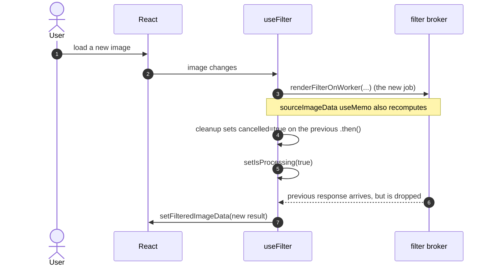

# Architecture

This document explains how **insta-studio** is wired together end-to-end. It
is the source of truth for contributors — when the implementation drifts,
update this file in the same change.

## Top-Level Layout

```
src/
├── App.tsx                      # React Router + QueryClient + Toaster shell
├── main.tsx                     # entry: createRoot(...).render(<App />)
├── pages/Index.tsx              # editor surface
├── components/                  # editor UI (FilterSidebar, AdjustmentsPanel,
│                                #   ImageCanvas, BottomBar, HistogramBadge, ...)
├── hooks/
│   ├── useFilter.ts             # image → filtered ImageData via the filter broker
│   └── useCustomPresets.ts      # CRUD for user-saved presets (localStorage)
├── lib/
│   ├── filterEngine.ts          # legacy facade (re-exports from filter-engine/)
│   ├── filter-engine/           # engine core
│   │   ├── types.ts             # Adjustments, FilterPresetDefinition, ImageAnalysis
│   │   ├── analysis.ts          # image → ImageAnalysis (luminance/channels/clipping)
│   │   ├── recommendation.ts    # ImageAnalysis → PresetRecommendation[]
│   │   ├── storage.ts           # localStorage CRUD for CustomPresetRecord
│   │   ├── raster.ts            # HTMLImageElement → ImageData (capped preview)
│   │   ├── utils.ts             # luminance/rgbToHsl/hslToRgb/boxBlurGray/curve LUT
│   │   └── index.ts             # re-exports + the public engine surface
│   ├── filters/
│   │   ├── index.ts             # applyFilter / prepareFilterSettings / renderBasePass
│   │   └── presets.ts           # FILTER_PRESETS + customPresetsToDefinitions
│   ├── filter-worker.ts         # main-thread broker around the filter Worker
│   ├── analysis-worker.ts       # main-thread broker around the analysis Worker
│   ├── imageImport.ts           # HEIC/HEIF/JPG/PNG/WEBP ingestion
│   └── editorToasts.ts          # tiny wrappers around useToast()
└── workers/
    ├── filterWorker.ts          # Web Worker entry — calls applyFilter
    └── analysisWorker.ts        # Web Worker entry — calls analyzeImageData
```

## Engine Passes

The renderer is a single composable pipeline. From
[`src/lib/filters/index.ts`](/Users/ollayor/Code/Projects/filtr-studio/src/lib/filters/index.ts),
`applyFilter` runs:

1. **Resolve settings** — `prepareFilterSettings` merges the preset, the
   preset-strength scale, the manual adjustments, and the scene adaptation.
   It also pre-builds the tone-curve LUTs and scales the HSL bands and
   split-tone balance.
2. **Base pass** (`renderBasePass`) — tonal shaping (brightness, contrast,
   highlights, shadows, whites, blacks), temperature/tint, HSL bands with
   the skin-band guard, tone curve, split toning.
3. **Detail pass** — `clarity` and `sharpness`. Skipped entirely when both
   are zero. Uses a `boxBlurGray` luminance buffer.
4. **Bloom pass** — bright-pass + box blur. Skipped when `bloom <= 0`.
5. **Final pass** — vignette, fade, grain.
6. **Monochrome enforcement** — only when `saturation <= -100 && vibrance <= -100`.
7. **Effect intensity blend** — blends the filtered result toward the
   original by `effectIntensity` (0..1). A value of 1 is a full filter,
   0 is a passthrough.

The scene-adaptation step (in `applySceneAdaptation`, same file) reduces
aggressive adjustments when the analysis reports the image is
portrait-heavy, low-light, already colorful, overexposed, etc. It can be
disabled with `adaptToScene: false`.

## Worker Topology

There are two dedicated workers, each behind a module-level broker that
serializes requests, cancels stale ones, and never tears down the worker
between requests.

### Filter broker

[`src/lib/filter-worker.ts`](/Users/ollayor/Code/Projects/filtr-studio/src/lib/filter-worker.ts)
owns a singleton `Worker` (created lazily on first
`renderFilterOnWorker` call). Each call enqueues a `RenderJob`
(`{ source, settings, resolve, reject, cancelled }`). The broker:

- Shifts the next job and `postMessage`s it to the worker with a
  monotonically increasing `id`.
- Routes the worker's `onmessage` to the in-flight job's `resolve` (or
  drops it if cancelled).
- Routes the worker's `onerror` to `reject` and continues draining the
  queue — a failure does not stop the broker.
- Exposes `cancelPendingFilterRenders()` to mark every queued and
  in-flight job as cancelled (used by the React hook to drop stale work).

[`src/workers/filterWorker.ts`](/Users/ollayor/Code/Projects/filtr-studio/src/workers/filterWorker.ts)
just calls `applyFilter(pixels, width, height, settings)` and posts the
resulting buffer back. The transferable `ArrayBuffer` is moved, not
copied.

### Analysis broker

[`src/lib/analysis-worker.ts`](/Users/ollayor/Code/Projects/filtr-studio/src/lib/analysis-worker.ts)
has the same shape, but the work is `analyzeImageData` (one pixel pass
with a stride, computing a 256-bin histogram and per-channel
clipping flags). The output `ImageAnalysis` contains
`Uint16Array(256)` histograms which aren't `Transferable`, so the worker
posts a cloned result (still cheap relative to the analysis cost).

### Request lifecycle

```mermaid
sequenceDiagram
    autonumber
    actor U as User
    participant C as React (Index.tsx)
    participant H as useFilter
    participant B as filter broker
    participant W as filterWorker
    participant E as engine applyFilter

    U->>C: drag Strength slider
    C->>H: adjustments + strength change
    H->>H: debounce 16ms (preview) or 250ms (export)
    H->>B: renderFilterOnWorker(sourceData, settings)
    B->>B: enqueue RenderJob
    B->>W: postMessage(request, [buffer])
    W->>E: applyFilter(pixels, w, h, settings)
    E-->>W: mutated pixel buffer
    W-->>B: postMessage(response, [buffer])
    B-->>H: resolve → ImageData
    H->>C: setFilteredImageData(result)
    C-->>U: canvas re-renders

    Note over H,B: If the user moves the slider again
    Note over H,B: before the response arrives, the hook bumps
    Note over H,B: latestRequestRef; the next .then() is a no-op.
```

### Cancellation flow



## React Shell

[`src/pages/Index.tsx`](/Users/ollayor/Code/Projects/filtr-studio/src/pages/Index.tsx)
is the editor surface. It owns the bulk of the editor's state:

- The current image, filename, and analysis result.
- The active preset (`activeFilter: string`), filter strength, effect
  intensity, and the manual `Adjustments` object.
- Compare mode, before-overlay, zoom, and an `exportSignal` counter that
  the bottom bar uses as a "please export" pulse.

It hands `useFilter` the source raster + settings, gets back
`{ filteredImageData, sourceImageData, isProcessing }`, and pipes the
result into `ImageCanvas`.

`useFilter` keeps two rasters — the full-resolution one (used when
`zoom > 150` and for export) and a preview raster capped at
`PREVIEW_MAX_DIMENSION = 1600`. The preview is what the editor renders
at 60 fps; the full raster is what the export pipeline consumes.

## Custom Presets

`useCustomPresets` is a thin React wrapper over
`loadCustomPresets / saveCustomPreset / deleteCustomPreset` in
[`src/lib/filter-engine/storage.ts`](/Users/ollayor/Code/Projects/filtr-studio/src/lib/filter-engine/storage.ts).
The hook keeps state in sync with the `storage` event (cross-tab) and a
custom `filtr:custom-presets-changed` event (same-tab panels).

`getFilterPresetByNameWithCustom` and `getFilterPresetByIdWithCustom` in
[`src/lib/filters/presets.ts`](/Users/ollayor/Code/Projects/filtr-studio/src/lib/filters/presets.ts)
resolve a name/id against the custom records first, then the built-in
map. They project a `CustomPresetRecord` into a full
`FilterPresetDefinition` by inheriting the base preset's `curve`,
`splitTone`, `hsl`, and `adaptive` settings, then merging the user's
adjustment overrides.

## Image Import

[`src/lib/imageImport.ts`](/Users/ollayor/Code/Projects/filtr-studio/src/lib/imageImport.ts)
detects HEIC/HEIF by MIME or extension, then converts to JPEG via
`heic-to` and decodes the converted blob. The native `Image` decoder is
used as a second-chance fallback if conversion throws. The previous
order tried native first, which always failed on non-Safari engines and
cost an `objectURL` round trip per file.

## CI

The Blacksmith workflow at
[`.github/workflows/blacksmith-ci-cd.yml`](/Users/ollayor/Code/Projects/filtr-studio/.github/workflows/blacksmith-ci-cd.yml)
runs `npm test`, `npm run lint`, and `npm run build` on every PR and
push to `main`. A `deploy` job promotes `main` to Vercel production.

## Visual Guide

| Layer | Source |
| --- | --- |
| Engine (pure functions) | `src/lib/filter-engine/`, `src/lib/filters/` |
| Worker entries (no DOM) | `src/workers/filterWorker.ts`, `src/workers/analysisWorker.ts` |
| Worker brokers (singleton + queue + cancel) | `src/lib/filter-worker.ts`, `src/lib/analysis-worker.ts` |
| React hooks | `src/hooks/useFilter.ts`, `src/hooks/useCustomPresets.ts` |
| UI shell + components | `src/pages/Index.tsx`, `src/components/` |

Anything that mutates pixels lives in the engine or worker files.
Anything that talks to `localStorage`, the DOM, or the canvas lives in
the React layer. The brokers are the only places that own a `Worker`.
